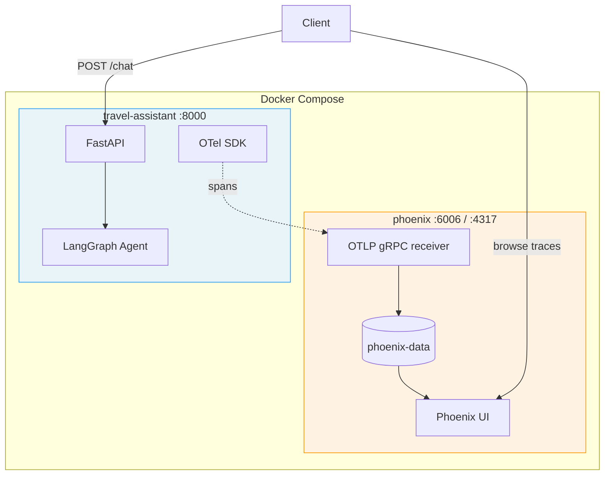
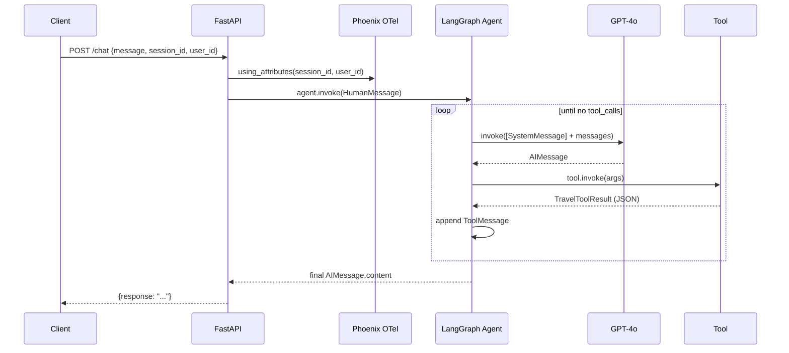
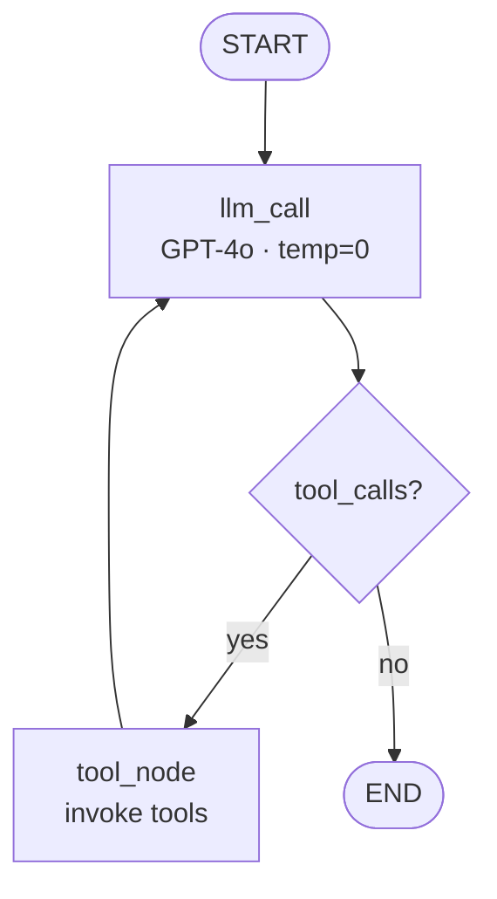
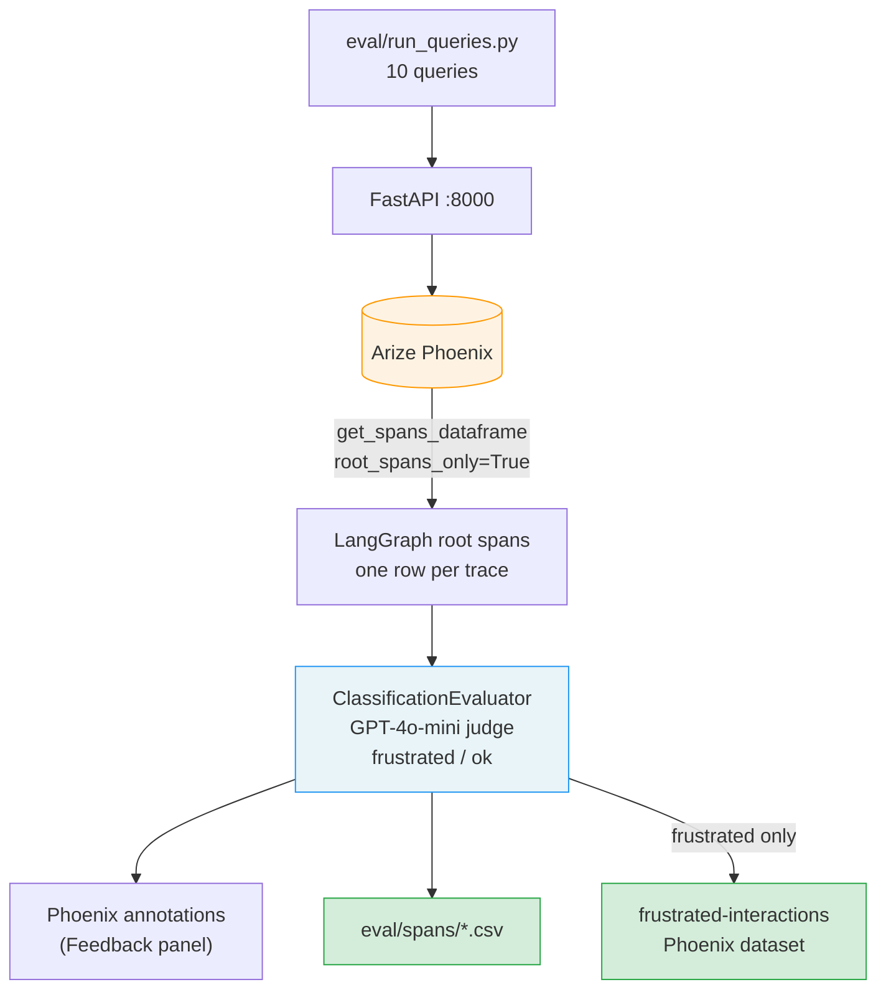

# Architecture Diagrams

---

## 1. System Topology

```mermaid
graph TD
    Client["Client"]

    subgraph docker ["Docker Compose"]
        subgraph ta ["travel-assistant  :8000"]
            API["FastAPI"]
            Agent["LangGraph Agent"]
            OTel["OTel SDK"]
        end

        subgraph ph ["phoenix  :6006 / :4317"]
            PhUI["Phoenix UI"]
            PhOTLP["OTLP gRPC receiver"]
            PhData[("phoenix-data")]
        end

        API --> Agent
        OTel -. "spans" .-> PhOTLP
        PhOTLP --> PhData --> PhUI
    end

    Client -- "POST /chat" --> API
    Client -- "browse traces" --> PhUI

    style ta fill:#e8f4f8,stroke:#2196F3
    style ph fill:#fef3e2,stroke:#FF9800
```

---

## 2. API Request Lifecycle

```mermaid
sequenceDiagram
    participant C as Client
    participant F as FastAPI
    participant P as Phoenix OTel
    participant G as LangGraph Agent
    participant O as GPT-4o
    participant T as Tool

    C->>F: POST /chat {message, session_id, user_id}
    F->>P: using_attributes(session_id, user_id)

    F->>G: agent.invoke(HumanMessage)

    loop until no tool_calls
        G->>O: invoke([SystemMessage] + messages)
        O-->>G: AIMessage

        G->>T: tool.invoke(args)
        T-->>G: TravelToolResult (JSON)
        G->>G: append ToolMessage
    end

    G-->>F: final AIMessage.content
    F-->>C: {response: "..."}
```

---

## 3. LangGraph Agent Graph

```mermaid
flowchart TD
    START(["START"]) --> llm_call

    llm_call["llm_call\nGPT-4o · temp=0"]
    sc{"tool_calls?"}
    tool_node["tool_node\ninvoke tools"]

    llm_call --> sc
    sc -- yes --> tool_node
    tool_node --> llm_call
    sc -- no --> END(["END"])
```

---

## 4. Evaluation Pipeline

```mermaid
flowchart TD
    RQ["eval/run_queries.py\n10 queries"]
    RQ --> API["FastAPI :8000"]
    API --> PH[("Arize Phoenix")]

    PH -- "get_spans_dataframe\nroot_spans_only=True" --> DF["LangGraph root spans\none row per trace"]

    DF --> EVA["ClassificationEvaluator\nGPT-4o-mini judge\nfrustrated / ok"]

    EVA --> ANN["Phoenix annotations\n(Feedback panel)"]
    EVA --> CSV["eval/spans/*.csv"]
    EVA -- "frustrated only" --> DS["frustrated-interactions\nPhoenix dataset"]

    style PH fill:#fef3e2,stroke:#FF9800
    style EVA fill:#e8f4f8,stroke:#2196F3
    style DS fill:#d4edda,stroke:#28a745
    style CSV fill:#d4edda,stroke:#28a745
```
