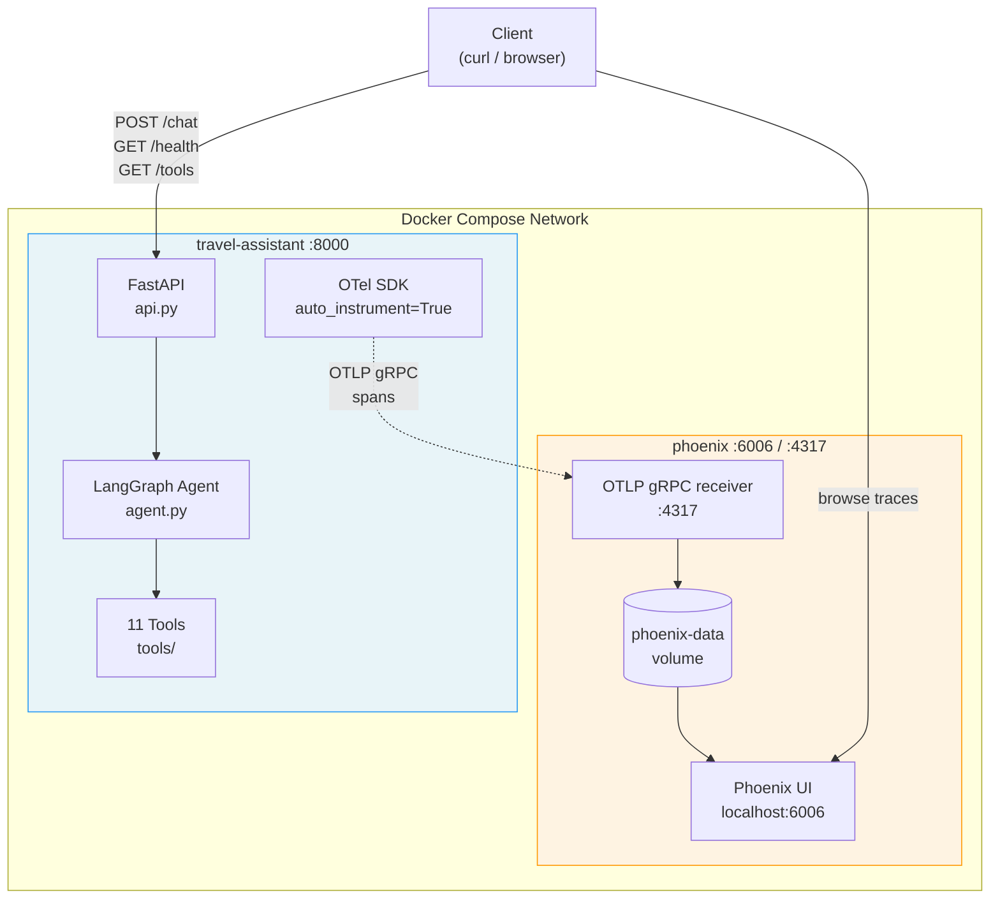
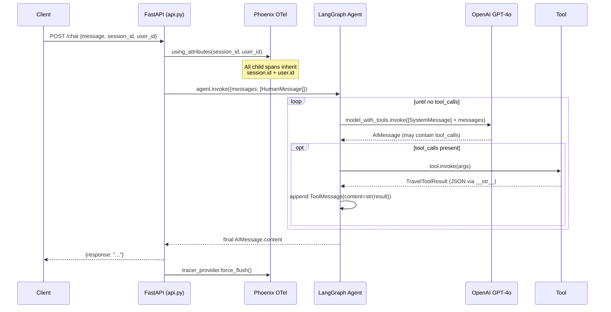
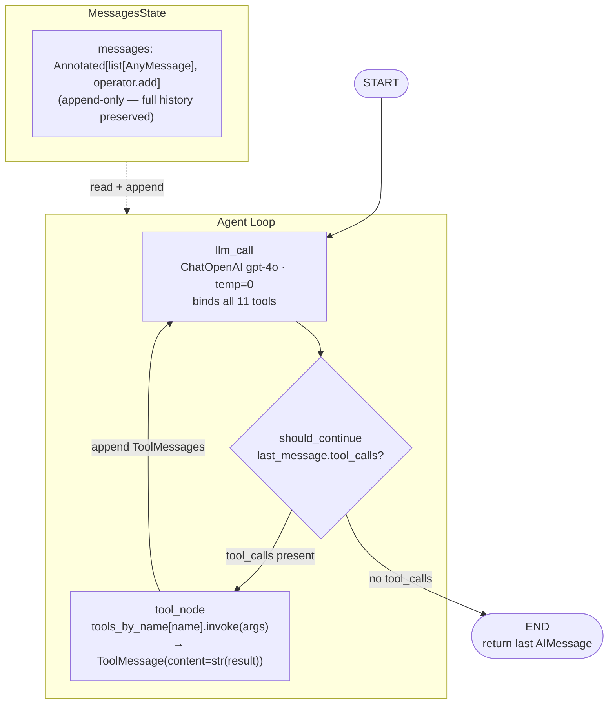
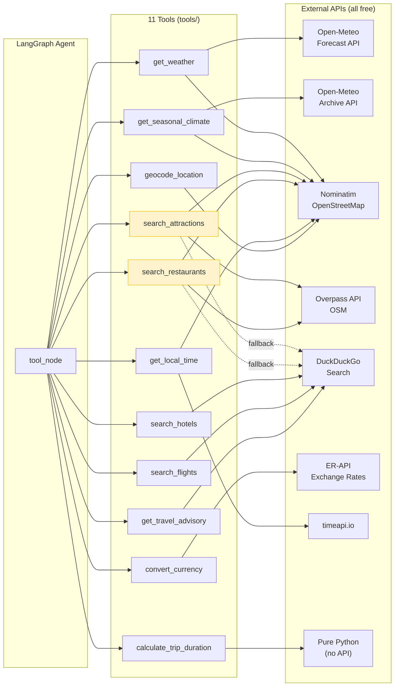
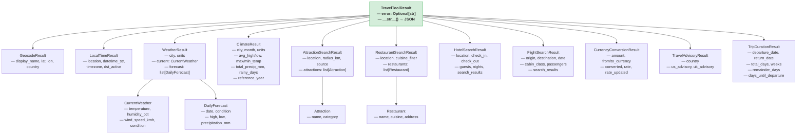
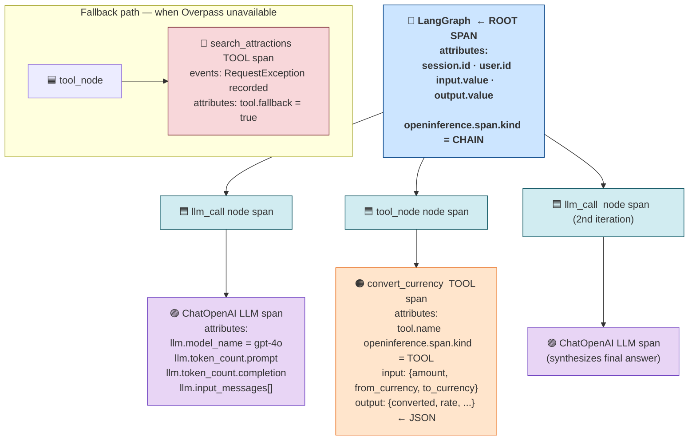
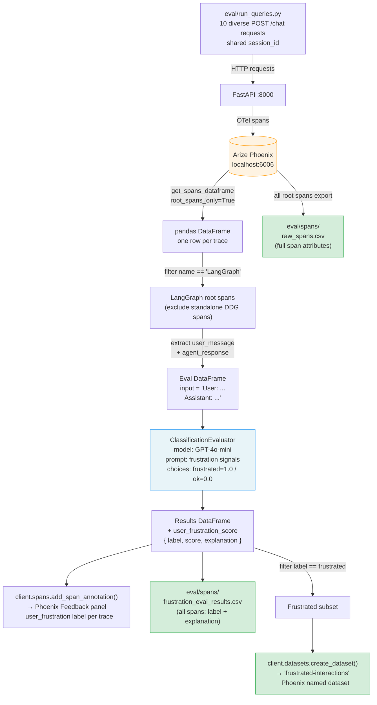

# Architecture Diagrams

Six diagrams covering every architectural layer of the travel assistant.

---

## 1. System Topology

Docker Compose runs two services. The travel assistant sends OpenTelemetry spans to Phoenix over gRPC; Phoenix exposes its UI on port 6006.

**Key wiring:** `PHOENIX_COLLECTOR_ENDPOINT=http://phoenix:6006` is set in `docker-compose.yml`. The health-check dependency ensures Phoenix is ready before the travel assistant starts.

---

## 2. API Request Lifecycle

Sequence of a single `POST /chat` call from client to response, showing where Phoenix context is attached.

---

## 3. LangGraph Agent Graph

The compiled `StateGraph` — nodes, edges, and the conditional router that drives the tool-call loop.

---

## 4. Tool Ecosystem

### 4a — Tools and their data sources

### 4b — Pydantic structured output model hierarchy

All tools return a typed subclass of `TravelToolResult`. The base class serializes to JSON via `model_dump_json(exclude_none=True)`.

---

## 5. OpenTelemetry Span Hierarchy

Anatomy of a single trace produced by one `POST /chat` request. Spans are nested by parent-child relationship; the root span is what the evaluator reads.

---

## 6. Evaluation Pipeline

Offline flow from trace generation through frustration scoring to exported artifacts.

